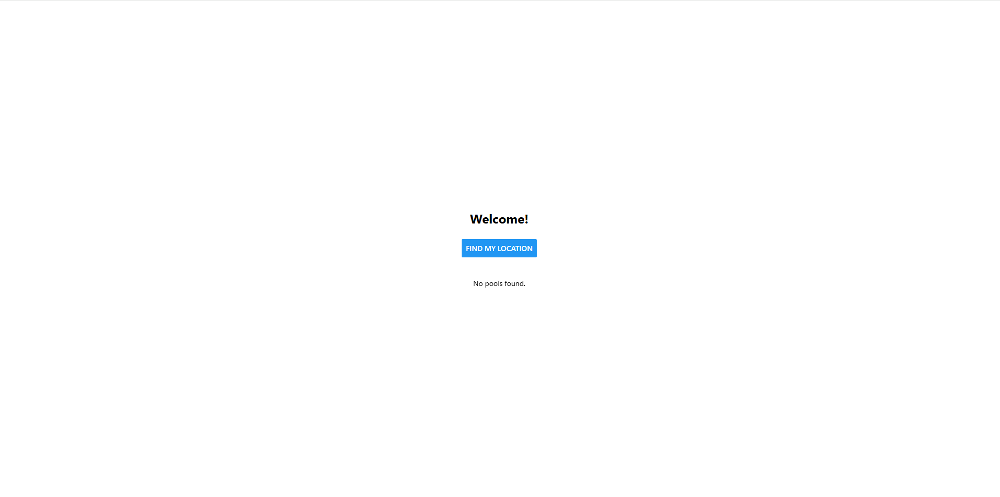
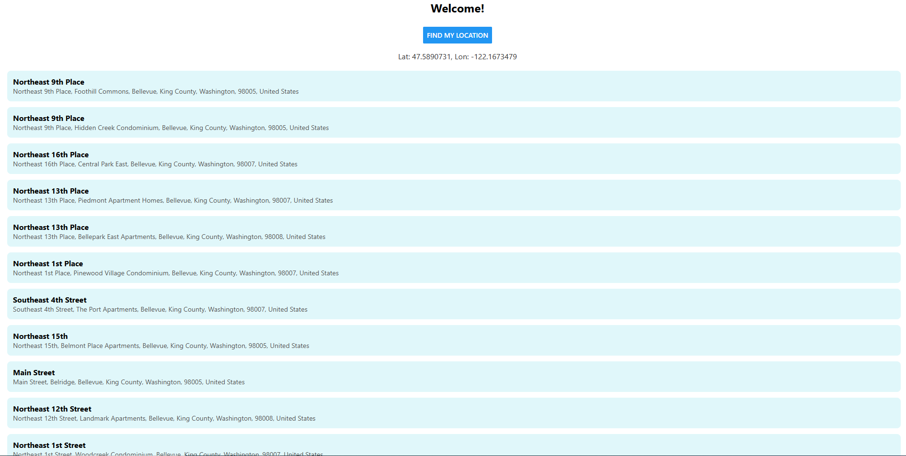

# Explore-expo-location

This is a React Native app built with Expo that requests the user's location and displays a list of nearby swimming pools using the OpenStreetMap Nominatim API.

## Features
- Requests location permission and fetches the user's current location
- Queries OpenStreetMap Nominatim for swimming pools near the user
- Displays results in a clean, scrollable list with pool names and addresses

## Getting Started

### Prerequisites
- [Node.js](https://nodejs.org/)
- [Expo CLI](https://docs.expo.dev/get-started/installation/)

### Installation
1. Clone this repository:
   ```bash
   git clone https://github.com/degerahmet/Explore-expo-location
   cd Explore-expo-location/locate_pools
   ```
2. Install dependencies:
   ```bash
   npm install
   ```
3. Start the Expo development server:
   ```bash
   npx expo start
   ```
4. Open the app on your device using the Expo Go app or in an emulator/simulator.

## Screenshots




## Reflection

See `REFLECTION.md` for a discussion of API choice, challenges, and future improvements.

---

This project uses [expo-location](https://docs.expo.dev/versions/latest/sdk/location/) and the [OpenStreetMap Nominatim API](https://nominatim.org/release-docs/latest/api/Search/).